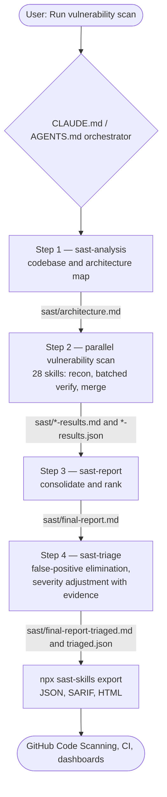

# sast-skills

[](https://www.npmjs.com/package/sast-skills) [](https://github.com/mstfknn/sast-skills/actions/workflows/test.yml) [](LICENSE) [](https://nodejs.org/)

Turn your LLM coding assistant into a fully featured SAST scanner. Drop-in agent skills for Claude Code, Codex, Opencode, Cursor, and any assistant that loads `CLAUDE.md` / `AGENTS.md` skill folders.


> Claude Code with Opus is recommended for quality; any capable model works.

---

## Flow

The orchestrator executes four phases — reconnaissance, parallel detection, synthesis, and triage:



Every step is **idempotent**: if its output file already exists, the orchestrator skips it. Re-run the scan after fixing issues to refresh only what's stale.

---

## What it detects

All skills follow the same three-phase pattern: **recon** → **batched verify** (parallel subagents, 3 per batch) → **merge**. Each writes a human-readable markdown report and a canonical JSON findings file that `sast-skills export` aggregates.

### Reconnaissance & Synthesis

| Skill | Role |
|---|---|
| `sast-analysis` | Codebase recon, architecture mapping, threat model |
| `sast-report` | Consolidate per-class findings into a ranked report |
| `sast-triage` | Remove false positives and adjust severities with codebase evidence |

### Injection

| Skill | Vulnerability Class |
|---|---|
| `sast-sqli` | SQL injection |
| `sast-nosql` | NoSQL injection (Mongo, Firestore, DynamoDB) |
| `sast-ldap` | LDAP filter / DN injection |
| `sast-graphql` | Unsafe GraphQL document construction |
| `sast-xss` | Cross-Site Scripting |
| `sast-ssti` | Server-Side Template Injection |
| `sast-rce` | Remote Code Execution (command injection, eval, unsafe deserialization) |
| `sast-xxe` | XML External Entity |
| `sast-ssrf` | Server-Side Request Forgery |
| `sast-openredirect` | Open redirect (phishing / OAuth token theft) |

### Access control & Auth

| Skill | Vulnerability Class |
|---|---|
| `sast-idor` | Insecure Direct Object Reference |
| `sast-missingauth` | Missing auth / broken function-level authorization |
| `sast-jwt` | Insecure JWT implementations |
| `sast-csrf` | Cross-Site Request Forgery |
| `sast-cors` | CORS misconfiguration |

### Files, crypto & runtime

| Skill | Vulnerability Class |
|---|---|
| `sast-pathtraversal` | Path / directory traversal |
| `sast-fileupload` | Insecure file upload |
| `sast-crypto` | Weak primitives, bad modes, IV reuse, weak PRNG |
| `sast-prototype` | JavaScript prototype pollution |
| `sast-redos` | Catastrophic-backtracking regex DoS |
| `sast-race` | Race conditions and TOCTOU |

### Data exposure & supply chain

| Skill | Vulnerability Class |
|---|---|
| `sast-hardcodedsecrets` | API keys / tokens / credentials in client-facing code |
| `sast-pii` | PII and credential leakage to logs / telemetry / error pages |
| `sast-deps` | Known-vulnerable dependencies (CVE in lockfiles) |
| `sast-iac` | Insecure IaC (Dockerfile / Terraform / Kubernetes / GitHub Actions) |

### Business logic & LLM-specific

| Skill | Vulnerability Class |
|---|---|
| `sast-businesslogic` | Price manipulation, workflow bypass, reward abuse |
| `sast-promptinjection` | Untrusted text reaching an LLM prompt (OWASP LLM #1) |
| `sast-llmoutput` | Unvalidated LLM output reaching code / HTML / SQL / shell sinks (OWASP LLM #2) |

---

## Installation

```bash
npx sast-skills install
```

The installer asks which assistant to target (`claude` / `agents` / `all`) and whether to install into the current project or your user home directory (`project` / `global`). To skip prompts:

```bash
npx sast-skills install --yes --assistant claude --scope project
```

> If your project already contains a `CLAUDE.md` or `AGENTS.md`, the installer refuses to clobber it by default — back it up or pass `--force`.

### CLI commands

| Command | What it does |
|---|---|
| `npx sast-skills install` | Copy `CLAUDE.md` / `AGENTS.md` and the skill tree into your project or `$HOME` |
| `npx sast-skills update` | Refresh an existing install with the currently bundled skill files |
| `npx sast-skills uninstall` | Remove installed skills; refuses to drop a modified `CLAUDE.md` without `--force` |
| `npx sast-skills doctor` | Verify an install and report `OK` / `MISSING` / `MODIFIED` per file; exits non-zero on issues |
| `npx sast-skills export --input sast/ --format sarif --output report.sarif` | Aggregate `sast/*-results.json` into JSON, SARIF 2.1.0, or HTML |
| `npx sast-skills export --input sast/ --triaged --format sarif` | Prefer the triaged `sast/triaged.json` over raw per-skill results |
| `npx sast-skills --version` | Print the installed CLI version |

### Install-time flags

| Flag | Purpose |
|---|---|
| `--yes` | Non-interactive; required when stdin is not a TTY |
| `--assistant <claude\|agents\|all>` | Which skill tree to install |
| `--scope <project\|global>` | Install into `./.claude/skills/` or `$HOME/.claude/skills/` |
| `--target <path>` | Explicit install target (overrides `--scope`) |
| `--force` | Overwrite a pre-existing `CLAUDE.md` / `AGENTS.md` |
| `--dry-run` | Print the file plan without writing |

---

## Running a scan

After installing, open the project in your AI assistant and ask:

> Run vulnerability scan

or

> Find vulnerabilities in this codebase

The orchestrator takes over. It runs all four phases automatically, respects idempotency (re-runs only pick up what's missing), and writes everything into `sast/` in your project root.

### Output files

| File | Description |
|---|---|
| `sast/architecture.md` | Technology stack, architecture, entry points, data flows |
| `sast/*-results.md` | Per-vulnerability-class findings (human-readable) |
| `sast/*-results.json` | Canonical machine-readable findings (fed to `sast-skills export`) |
| `sast/final-report.md` | Consolidated raw report ranked by severity |
| `sast/final-report-triaged.md` | Triaged report — false positives removed, severities adjusted with evidence |
| `sast/triaged.json` | Canonical triaged findings (preferred by `sast-skills export --triaged`) |

### Finding schema

Every `sast/*-results.json` and `sast/triaged.json` conforms to:

```jsonc
{
  "run": { "tool": "sast-skills", "version": "0.1.0" },
  "findings": [
    {
      "id": "sast-sqli-0001",
      "skill": "sast-sqli",
      "severity": "critical|high|medium|low|info",
      "title": "SQL injection in /api/user",
      "description": "…",
      "location": { "file": "src/api/user.js", "line": 42, "column": 10 },
      "remediation": "…"
    }
  ]
}
```

Triaged findings add `triage_status` (`confirmed|upgraded|downgraded|false_positive`), `triage_original_severity` (when severity changed), and `triage_evidence` with concrete codebase citations.

---

## CI integrations

### GitHub Code Scanning (SARIF)

Composite action at `.github/actions/scan/action.yml`:

```yaml
- uses: utkusen/sast-skills/.github/actions/scan@main
  with:
    input: sast/
    output: sast-skills.sarif
```

This runs `sast-skills export --format sarif` and uploads the result to Code Scanning via `github/codeql-action/upload-sarif@v3`.

### Pre-commit hook

Copy [hooks/pre-commit](hooks/pre-commit) into `.git/hooks/pre-commit` to make `sast-skills doctor` gate every commit.

### Docker

```bash
docker build -t sast-skills .
docker run --rm -v "$PWD:/work" sast-skills export --input sast/ --format sarif --output report.sarif
```

The bundled `Dockerfile` is `node:20-alpine`-based with `sast-skills` set as the entrypoint.

---

## Verify & troubleshoot

```bash
# Is the install in the expected shape?
npx sast-skills doctor --target . --assistant claude

# Version check
npx sast-skills --version
npm view sast-skills version    # latest on the registry

# Upgrade
npx sast-skills update
```

`doctor` exits `0` if every bundled file in the target matches the installed version's copy, and `1` if any file is `MISSING` or `MODIFIED`. `MODIFIED` means the file diverged from the bundled copy — expected if you edit the entry file, otherwise a signal to run `update`.

---

## Contributing

See [CONTRIBUTING.md](CONTRIBUTING.md). Developer loop:

```bash
npm install
npm test                                  # vitest suite (TDD-guard enabled)
npm run sync                              # mirror .claude/skills → .agents/skills
node scripts/scaffold-skill.js sast-foo   # stub a new skill in both trees
node scripts/register-skill.js sast-foo foo "Foo" "Foo injection description"
npm run lint:md                           # markdownlint
```

`prepublishOnly` runs `npm run sync && npm test` — a dirty mirror or a red test aborts `npm publish`.

- Community standards: [CODE_OF_CONDUCT.md](CODE_OF_CONDUCT.md)
- Release history: [CHANGELOG.md](CHANGELOG.md)

---

## License

MIT — see [LICENSE](LICENSE).
